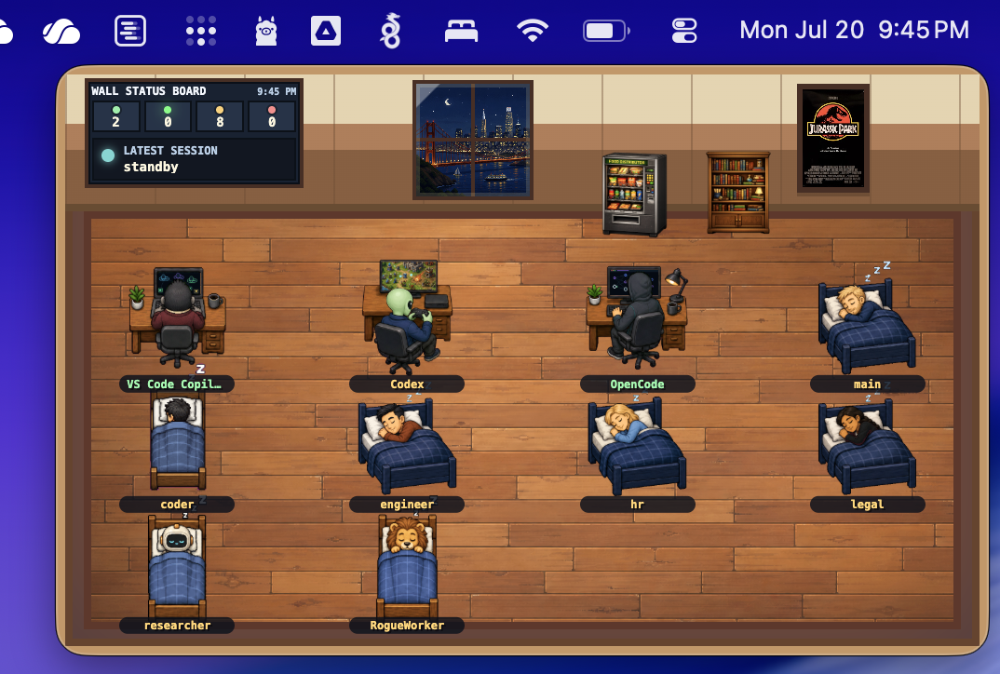
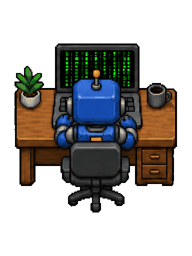
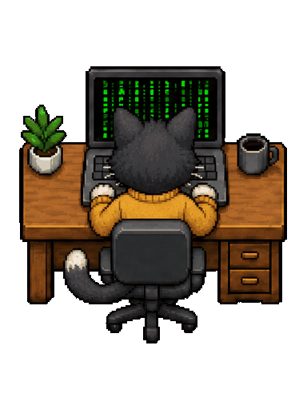
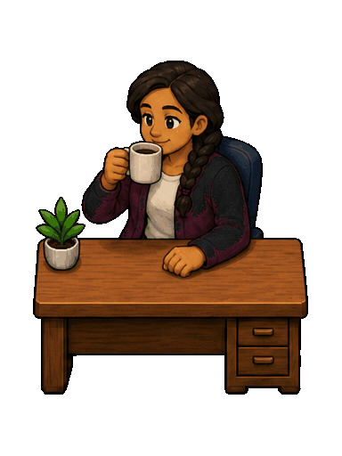
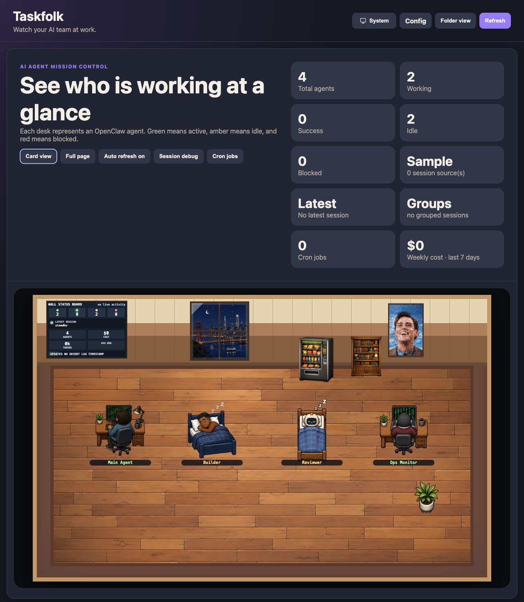

# Taskfolk


Taskfolk is a desktop companion that turns your AI coding sessions into a live pixel office. Keep it beside your editor to see which agents are working, successful, idle, or blocked without opening another dashboard.

**New to Taskfolk?** See the [Taskfolk User Guide](USER_GUIDE.md) for macOS installation, Privacy & Security approval, first-run setup, integrations, and app configuration.

| Live pixel office | Multiple desktop avatars |
| :---: | :---: |
|  |  |
|  |  |

## Start the companion app

using the latest dmg or running the following commands:

```bash
npm install
npm run desktop
```

On first launch, choose how the companion gets its data:

- **Run in this app** starts a private Taskfolk server automatically. No separate server is required. This mode supports local or remote OpenClaw gateways plus OpenCode, Codex, Claude, Gemini CLI, Gemini Code Assist Agent mode, and Visual Studio Code Copilot activity.
- **Connect to a remote server** connects the companion to an existing Taskfolk instance using its URL and gateway credentials.

The companion can display the complete office or one live avatar on a transparent background. Drag it anywhere, resize it, adjust its opacity, keep it above other windows, or leave it running from the tray or menu bar. Window settings are remembered between launches.

### One folk or the whole crew

Switch to **Single Avatar** when you want one compact, transparent companion beside your editor:


Use **Add Another Folk** from the right-click menu to place multiple independent companion windows on screen. Each folk can represent a different connected agent and can be moved or resized separately:


### Meet some animated folk

These avatars animate in the companion as their live state changes:

| Reading | Working Robot | Working Cat | Coffee break |
| :---: | :---: | :---: | :---: |
|  |  |  |  |

Avatar variants are discovered when the server starts. Each assignable folder under
`public/avatar-scenes/variants/` must be named `v<number>`, contain the canonical
`working.gif`, and include an `avatar.json` metadata file:

```json
{
  "name": "Tuxedo Cat",
  "workingScreen": { "left": 112, "top": 95, "width": 156, "height": 89 }
}
```

`workingScreen` is optional. Include it when the variant has a `working_alpha.png`
plate and should use the shared working-screen animation pool.

Add an optional `sheet.png` to the same avatar folder to show the full pose sheet
in the avatar picker. When `sheet.png` is absent or cannot be loaded, the picker
uses that avatar's `working.gif` as its preview.

Variants with missing or invalid metadata are skipped with a startup warning. The
`v0` variant is required and is used whenever a saved assignment references a
variant that is no longer installed. Restart Taskfolk after adding or removing a
variant so the registry is rebuilt.

### Live coding-session support

- **OpenCode Desktop and terminal sessions** — detects projects, session state, model, agent, and activity timestamps. For terminal sessions, run `opencode --port 4096` so the companion can connect.
- **Visual Studio Code Copilot chats** — detects active chats in VS Code and VS Code Insiders without an extra extension, server, or Copilot token.
- **Codex Desktop and CLI tasks** — detects active Codex work from its local, read-only task index and lifecycle event metadata without an API token.
- **Gemini CLI and Gemini Code Assist Agent mode** — detects Gemini CLI projects from local session metadata and Code Assist Agent-mode workspaces from its local VS Code agent process.
- **OpenClaw gateway** — connects to a local or remote OpenClaw instance and reads configured agents plus safe session metadata over the gateway's read-only RPCs.
- **OpenClaw and manual agents** — connect to a remote Taskfolk server to display configured OpenClaw agents or agents that publish their own status through the API.

Taskfolk reads only the local metadata needed to represent activity. It does not read or publish prompts, response text, tool output, attachments, or credentials. See [Companion app reference](#companion-app-reference) for setup options, privacy details, window controls, and packaging.

## Web dashboard

The same live office is available as a browser dashboard with configuration, shared-folder tools.



### Dashboard features

- At-a-glance active, success, idle, and blocked agent states.
- Live agent refreshes from OpenClaw, desktop connectors, manual agents, or `OPENCLAW_AGENTS_JSON`.
- Light, dark, and system themes.
- Upload, download, preview, edit, and archive tools in the folder view.

### Run the dashboard locally

```bash
npm install
npm start
```

Open <http://localhost:3000>.

## Companion app reference

Taskfolk includes an Electron companion that shows the pixel office in a small native window. Left-click and drag anywhere inside the window to move it; a narrow six-pixel edge remains reserved for resizing. The window remembers separate bounds for each display mode, can stay above other windows, and keeps running from the system tray or menu bar. On macOS, Setup offers an optional **Show folk on all Desktops and full-screen Spaces** setting. It is disabled by default.

The packaged desktop app uses the universal digital-agent icon at `desktop/icon.png` for application windows, the Dock, and installers.

Choose one of two office sources:

- **Run in this app** starts a private Taskfolk server on a loopback port selected during the first launch and saved for reuse on later launches. It requires no separately running Taskfolk server and offers local OpenClaw, OpenCode, Codex, Claude, Gemini, and VS Code Copilot agents. The folder-view module is disabled by default in this mode. Local server data is kept in the desktop app's user-data directory, and a new private gateway token is generated for every app launch.
- **Connect to a remote server** uses a running Taskfolk URL (for example `http://127.0.0.1:3000`), its gateway token, and optional gateway password. The companion exchanges those credentials for the normal Taskfolk session cookie.

Remote credentials are never placed in the URL and are encrypted with Electron `safeStorage` when operating-system encryption is available. You can switch office sources later from **Setup**.

For managed or temporary launches, settings can be supplied without saving them:

```bash
TASKFOLK_URL=http://127.0.0.1:3000 \
TASKFOLK_TOKEN=your-gateway-token \
npm run desktop
```

Set `TASKFOLK_PASSWORD` too when the gateway requires one. Environment credentials take precedence over saved settings for that launch.

### Track OpenCode Desktop and terminal sessions

The desktop companion can publish local OpenCode activity into the connected Taskfolk dashboard. OpenCode Desktop is detected automatically while it is running. The companion reads session title, workspace, model, agent, completion state, and timestamps from OpenCode's local SQLite database; it does not read prompts, message text, tool output, or credentials.

For OpenCode terminal sessions, start the TUI on a fixed loopback port so the companion can attach to the same session server:

```bash
opencode --port 4096
```

In **Setup**, enable **Track OpenCode Desktop and terminal sessions**, then choose **One agent per project** or **One agent for all projects**. The adapter merges automatically discovered Desktop activity with the terminal server's `/session/status` and `/session` endpoints, sends normalized session metadata to Taskfolk, and removes runtime agents when OpenCode becomes unavailable. Each grouping mode keeps its own stable avatar configuration.

Each OpenCode project gets its own stable avatar configuration key, so it keeps an independent avatar across new sessions and restarts even though OpenCode changes the underlying session ID. Up to 24 recently active projects can appear at once. The Config page automatically migrates the former global and older per-session OpenCode assignments onto discovered projects. Use **Disable** to hide a project while preserving its configuration, or **Remove** to forget its avatar and drop it from the current discovery snapshot. A removed project can reappear with the default configuration the next time OpenCode publishes it.

If the OpenCode server uses HTTP Basic authentication, enter its username and password in Setup. The default username is `opencode`. The password is encrypted with Electron `safeStorage` when operating-system encryption is available. Managed launches can provide `OPENCODE_SERVER_USERNAME` and `OPENCODE_SERVER_PASSWORD` instead.

### Connect an OpenClaw instance

In **Setup**, enable **Connect to an OpenClaw instance** and enter the gateway URL. The default is `ws://127.0.0.1:18789`; `http://` and `https://` inputs are converted to their WebSocket equivalents. Remote gateways should use `wss://`. Plain `ws://` is also accepted for loopback and Tailscale's encrypted `100.64.0.0/10` address range.

Remote gateways require OpenClaw device pairing. Taskfolk creates and securely stores a stable Ed25519 device identity. Use **Test connection / request approval** in Setup to submit the pairing request before opening the office. Setup reports the connection stage, device ID, gateway error codes, and exact request ID. On the OpenClaw host, verify the pending **Taskfolk** request and approve it with the displayed `openclaw devices approve <requestId>` command, then test again. The approved device token is stored with the operating system's secure storage and reused for that gateway.

Taskfolk requests `agents.list` and `sessions.list` with the `operator.read` scope, then publishes configured agents, current status, session title, model, workspace, and timestamps into the office. It does not request transcript messages, prompts, tool output, or configuration writes. Gateway tokens and passwords are encrypted with Electron `safeStorage` when available. Managed launches can provide `OPENCLAW_GATEWAY_URL`, `OPENCLAW_GATEWAY_TOKEN`, and `OPENCLAW_GATEWAY_PASSWORD`.

### Track Visual Studio Code Copilot chats

The desktop companion can also publish GitHub Copilot chat activity from Visual Studio Code and Visual Studio Code Insiders. In **Setup**, enable **Track Visual Studio Code Copilot chats**, then choose **One agent per project** or **One agent for all projects**. No Copilot server, token, or additional VS Code extension is required.

This connector reads VS Code's local, machine-scoped chat index and session file timestamps in read-only mode. It uses only the workspace identity, session title, empty-session flag, and timestamps needed to build Taskfolk agents. It does not load or publish prompt bodies, response text, tool output, attachments, or Copilot credentials. Sessions are shown only while VS Code is running, empty chats are ignored, and each workspace keeps a stable avatar configuration key across chat sessions and restarts.

### Track Codex Desktop and CLI tasks

In **Setup**, enable **Track Codex Desktop and CLI tasks**, then choose **One agent per project** or **One agent for all projects**. No OpenAI API key, ChatGPT credential, server, or extra extension is required. Taskfolk automatically discovers the local Codex state database under `CODEX_HOME` or `~/.codex` and shows sessions only while Codex Desktop or the Codex CLI is running.

The connector opens Codex's task index read-only and uses task title, project path, model, client type, timestamps, and lifecycle event kinds to build Taskfolk agents. It inspects only the tail of each current rollout to distinguish started, completed, aborted, and failed work. Prompt bodies, response text, reasoning, tool inputs and outputs, attachments, and credentials are not published. Each project keeps a stable avatar configuration key across Codex tasks and restarts.

### Track Claude Cowork and Claude Code tasks

In **Setup**, enable **Track Claude Cowork and Claude Code tasks**, then choose **One agent per project** or **One agent for all projects**. No Anthropic API key, Claude credential, server, or extra extension is required. Taskfolk discovers Claude's local project transcripts under `CLAUDE_CONFIG_DIR` or `~/.claude/projects` and shows sessions only while Claude Desktop or the Claude Code CLI is running.

The connector reads transcript tails in read-only mode and retains only working directory, session ID, generated/custom title, model, timestamp, and lifecycle metadata. Prompt bodies, responses, reasoning, tool inputs and outputs, attachments, and credentials are not published. Each project keeps a stable avatar configuration key across Claude sessions and restarts.

Claude Cowork can run remotely and continue after Claude Desktop closes. Anthropic does not currently expose those cloud sessions through a local consumer status API, so Taskfolk can track local Claude Code sessions (including Code launched from Claude Desktop), but not remote-only Cowork execution. Such sessions are omitted rather than shown with a guessed status.

### Track Gemini CLI and Gemini Code Assist Agent mode

In **Setup**, enable **Track Gemini CLI and Gemini Code Assist Agent mode**, then choose **One agent per project** or **One agent for all projects**. Taskfolk discovers Gemini CLI session files under `GEMINI_CLI_HOME/.gemini/tmp` or `~/.gemini/tmp` and shows them only while Gemini CLI is running. It retains only the project path, session ID, summary/title, model, and timestamps needed to build an agent; prompt and response bodies, tool output, and credentials are not published.

For the Gemini Code Assist VS Code extension, Taskfolk detects the extension's local Agent-mode process and obtains its workspace from the process working directory. This supports Code Assist Agent mode without a Google credential or a Taskfolk-specific IDE extension. The consumer Gemini app, ordinary Code Assist chat, inline completions, and JetBrains activity are not shown because Google does not expose live local task status or safe session metadata for those surfaces. They are omitted rather than inferred from general app or editor activity.

### Track Google Antigravity agents

In **Setup**, enable **Track Google Antigravity agents**, then choose **One agent per project, plus conversations** or **One agent for all Antigravity activity**. No Google credential, server, or Taskfolk-specific extension is required. Taskfolk discovers Antigravity's local agent logs under `ANTIGRAVITY_HOME/brain` or `~/.gemini/antigravity/brain` and shows activity only while the Antigravity app or its local language server is running.

The connector reads Antigravity's separate generated-title index, project marker and workspace URI plus session IDs, lifecycle states, step types and sources, and timestamps. Conversations belonging to the same project share one stable agent and avatar. All chats marked outside a project are folded into one **Antigravity · Conversations** agent. Transcript content is deliberately discarded, so prompts, responses, reasoning, tool input and output, artifacts, and Google credentials are not published.

The Taskfolk server keeps desktop-published runtime agents in memory and expires them after 90 seconds without an update. Override this with `RUNTIME_AGENT_TTL_MS` if needed.

The setup page can choose between the full office and a single live avatar on a transparent background. In avatar mode, choose which connected agent to display; its pose continues to update from the live agent state. The setup page also controls window opacity from 25% to 100%.

Choose **Most recently updated (automatic)** in Setup or the single-avatar right-click menu to follow agent activity automatically. On every live refresh, the companion compares the agents' latest activity timestamps and switches to the avatar whose status or session data changed most recently.

In single-avatar mode, transparent pixels are click-through: clicks and scrolling pass to the application underneath. Opaque avatar pixels remain interactive so they can be dragged or right-clicked to open the companion menu.

The single-avatar right-click menu includes **Avatar Size** presets for Tiny (120×150), Extra Small (150×190), Small (220×280), Medium (300×380), Large (420×540), and Extra Large (560×720). Presets resize around the current window center, remain inside the active screen, and are remembered for the next launch.

Setup also accepts a custom avatar width and height. Values are constrained to 120–1200 pixels wide and 150–1200 pixels high. Use **Reset to 300 × 380** to restore the default avatar dimensions before applying the settings.

Right-click anywhere in the companion window to switch back to **Office View**, choose a different agent from **Single Avatar**, add another independent folk window, change an opacity preset, open **Setup** or the full **Config** page, reload, hide, toggle **Always on Top**, or quit. Setup and Config are also available from the **Office** application menu and tray icon. Config opens in a separate authenticated desktop window and works with both local and remote office modes.

When changing views or reloading, the companion hides the remote page immediately, displays an animated loading indicator, waits for the office or avatar artwork to finish rendering, and then fades the completed view into place.

To produce an installer for the current platform:

```bash
npm run desktop:dist
```

Installers are written to `dist/`, which is gitignored.

For a macOS test installer without a Developer ID certificate, produce a complete
ad-hoc signature instead of leaving the Electron bundle partially signed:

```bash
npm run desktop:dist:test
```

macOS will still block this test build because its developer is unidentified. A
tester should be able to attempt to open it once, then approve it from **System
Settings → Privacy & Security → Open Anyway**. Ad-hoc signatures are not trusted
for distribution, so behavior can vary by macOS version. Public releases should
use Developer ID signing and Apple notarization instead.

## Run in docker

```bash
docker compose up -d --build
```

The folder-view module is disabled by default and the base Compose file does not mount host workspaces. To enable it, use the dedicated override:

```bash
docker compose -f docker-compose.yml -f docker-compose.FolderModule.yml up -d --build
```

The override sets `FOLDER_VIEW_ENABLED=true` and mounts the configured OpenClaw and development workspaces under `/shared`. Edit its host paths to choose which folders Taskfolk can access. For a non-Compose server launch, set `FOLDER_VIEW_ENABLED=true` directly in the environment.

## Gateway login

Taskfolk supports the same auth shape as OpenClaw gateway config:

```json
{
  "gateway": {
    "auth": {
      "token": "required-token",
      "password": "optional-password"
    }
  }
}
```

When `gateway.auth.token` exists, the web UI and app APIs require a browser login. If `gateway.auth.password` also exists, login requires both values.

For Docker Compose, put the values in a project `.env` file:

```dotenv
GATEWAY_AUTH_TOKEN=required-token
GATEWAY_AUTH_PASSWORD=optional-password
GATEWAY_AUTH_SECURE_COOKIE=false
```

Docker Compose reads that `.env` file for the `${GATEWAY_AUTH_*}` substitutions in `docker-compose.yml`, and the service maps them into Taskfolk auth. In gateway mode these environment variables are the Taskfolk web-login source, so an OpenClaw config mount is not required. In files mode, env values take precedence over `gateway.auth.*` in the mounted `openclaw.json`.

Leave `GATEWAY_AUTH_SECURE_COOKIE=false` for local plain-HTTP access such as `http://127.0.0.1:3000`. Set it to `true` only when the page is served over HTTPS.

## Agent data

The standalone server supports three OpenClaw connection modes. Select one with `OPENCLAW_CONNECTION_MODE`:

- `none` (default) disables OpenClaw discovery. Taskfolk can still show manual agents and other runtime integrations.
- `files` reads OpenClaw data from the mounted runtime paths listed below.
- `gateway` connects to `OPENCLAW_GATEWAY_URL` and requests configured agents, safe session metadata, configuration, cron jobs, and cron run history from read-only gateway RPCs.

An unset or empty `OPENCLAW_CONNECTION_MODE` is treated as `none`. The supplied `docker-compose.yml` therefore starts with OpenClaw disabled unless you explicitly select a connection mode. It does not mount OpenClaw's logs, config, state database, cron directory, agent session stores, or workspaces. Only Taskfolk's own `./config` directory is mounted by default.

For example, add these values to the Compose project's `.env` file:

```dotenv
OPENCLAW_CONNECTION_MODE=gateway
OPENCLAW_GATEWAY_URL=127.0.0.1:18789
OPENCLAW_GATEWAY_TOKEN=optional-openclaw-token
OPENCLAW_GATEWAY_PASSWORD=optional-openclaw-password
```

Then start Taskfolk with the provided gateway override:

```bash
docker compose -f docker-compose.yml -f docker-compose.gateway.yml up -d --build
```

The URL may omit the scheme (as above), in which case `ws://` is used. From a Docker container, `127.0.0.1` refers to the container itself; use host networking or a host-reachable name such as `host.docker.internal` when OpenClaw runs on the Docker host.

To use the legacy file reader instead, add the provided Compose override:

```bash
docker compose -f docker-compose.yml -f docker-compose.files.yml up -d
```

In `files` mode, the dashboard reads OpenClaw data from these mounted runtime paths:

- `OPENCLAW_CONFIG_PATH` — defaults to `/config/openclaw.json`
- `OPENCLAW_LOG_DIR` — defaults to `/tmp/openclaw`
- `OPENCLAW_SESSIONS_DIR` — defaults to `/openclaw-agents`

It reads configured agents from `openclaw.json`, then overlays safe session metadata from mounted OpenClaw `sessions.json` files. Session stores are expected at paths like `/openclaw-agents/<agentId>/sessions/sessions.json`; transcript `.jsonl` files are not required. Recent session failures mark an agent as blocked.

For local demos or overrides, set `OPENCLAW_AGENTS_JSON` to an array:

```json
[
  { "id": "main", "name": "Main Agent", "role": "Coordinator", "status": "active", "task": "Working item 7", "x": 24, "y": 52 }
]
```

`status` can be `active`, `success`, `idle`, or `blocked`. If no config or logs are available, the UI falls back to sample agents.

The office scene config can include `emptyDesks` to reserve desk slots in the pixel office. Manage it from the Config page's Pixel office controls, or set it in the saved avatar scene config:

```json
{
  "officeScene": { "floor": "wood", "windowView": "sf", "poster": 10, "emptyDesks": 2 }
}
```

`poster` is a zero-based index for files in `public/office-scenes/posters`, so `10` renders `poster11.jpeg`.

## Manual agents

The Config page at `/avatar-legend.html` lets you give every discovered agent an optional custom name; clear the field to return to its automatically generated name. It can also add agents that do not come from logs or OpenClaw session stores. Use **Add agent** at the bottom of the live agent list, then choose an avatar variant, set the display name, and copy the generated token. Manual agents can be disabled without deleting their token or avatar assignment; disabled manual agents stay editable on the Config page but are omitted from the office view and cannot update status. Names and manual agents are saved in `avatar-assignments.json` alongside avatar assignments:

```json
{
  "assignments": { "manual-example": 2 },
  "customNames": { "runtime:codex-single": "Release Helper" },
  "manualAgents": [
    { "id": "manual-example", "name": "Manual Example", "token": "generated-token", "enabled": true }
  ]
}
```

Manual agents update their current office state through the agent state API:

```bash
curl -X POST http://localhost:3000/api/agent-state \
  -H 'Content-Type: application/json' \
  -d '{"token":"generated-token","state":"Working","task":"Handling queue item 42"}'
```

You can also pass the token as `X-Agent-Token` and omit `token` from the JSON body. The accepted states are `Working`, `Success`, `Blocked`, `Sleeping`, `Reading`, `Gaming`, `Coffee break`, `Listening`, and `Walking`. API calls update `state.json` in `CONFIG_DIR` (default `/config/state.json`), and `/api/agents` merges that file into the office view so manual agents appear beside detected agents.

### Agent status skill

This repo includes a reusable skill at `skills/taskfolk-agent-status/SKILL.md` for agents that should update their own office status. Add the manual agent token to that agent's environment as `TASKFOLK_AGENT_TOKEN`; optionally set `TASKFOLK_AGENT_STATUS_URL` if Taskfolk is not at `http://localhost:3000/api/agent-state`.

Add this to the agent's `SOUL.MD`:

```md
Use the `taskfolk-agent-status` skill for every task. Set your Taskfolk status to Working before beginning work, and set it to Success before sending the final response.
```

### Status calculation

Taskfolk starts from configured agents in `openclaw.json` and overlays matching session/log activity:

- The primary source is `agents.list[]` in `openclaw.json`; each entry uses `id` and `name` for the dashboard card.
- If `agents.list[]` is missing, config entries under agent-like containers such as `agents`, `agentProfiles`, `agentConfigs`, `assistants`, or `sessions` are used as a fallback.
- Mounted `sessions.json` files are matched by their path, `agentId` fields, or session keys like `agent:<id>:...`; the newest available session timestamp (including nested message/run metadata and file modification time) becomes the agent's last activity.
- Log lines are matched by fields like `agentId`, `agent_id`, `agent`, `agentName`, `sessionKey`, `session`, `label`, or `name`.
- `active`: latest matching session or log timestamp is within `AGENT_ACTIVE_MS` (default 2 minutes).
- `success`: a completed session remains in its success animation for `AGENT_SUCCESS_MS` (default 2 minutes).
- `idle`: configured agent has no matching runtime activity, or latest activity is older than the active window.
- `blocked`: latest task/log text contains `error`, `failed`, `failure`, `exception`, `blocked`, or `fatal`.

If a log line has no timestamp, the log file modification time is used as a fallback. The `/api/agents` response includes `statusRules` so the UI/API makes these thresholds visible.
