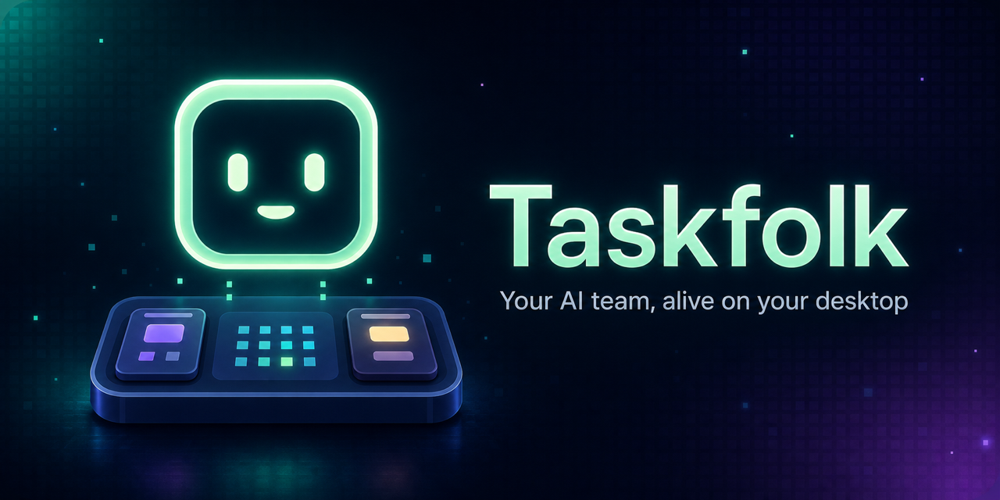
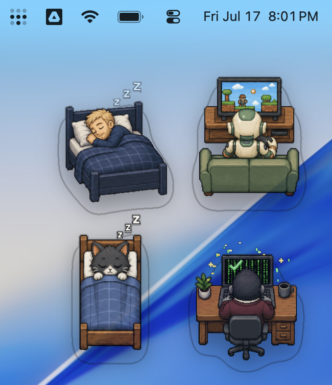
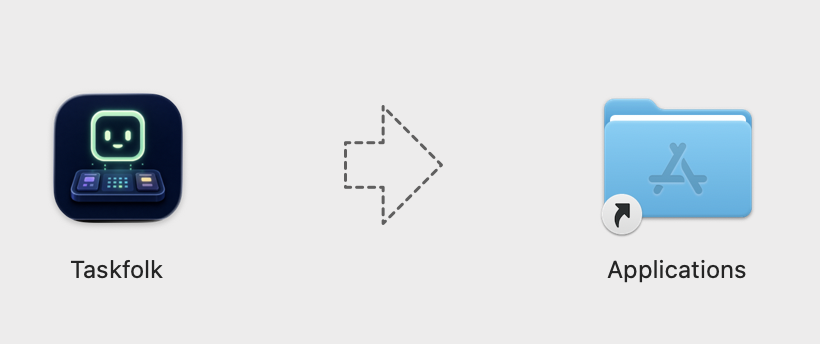
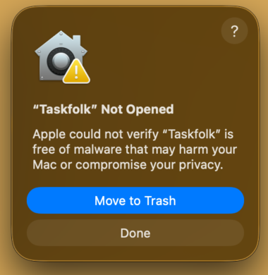
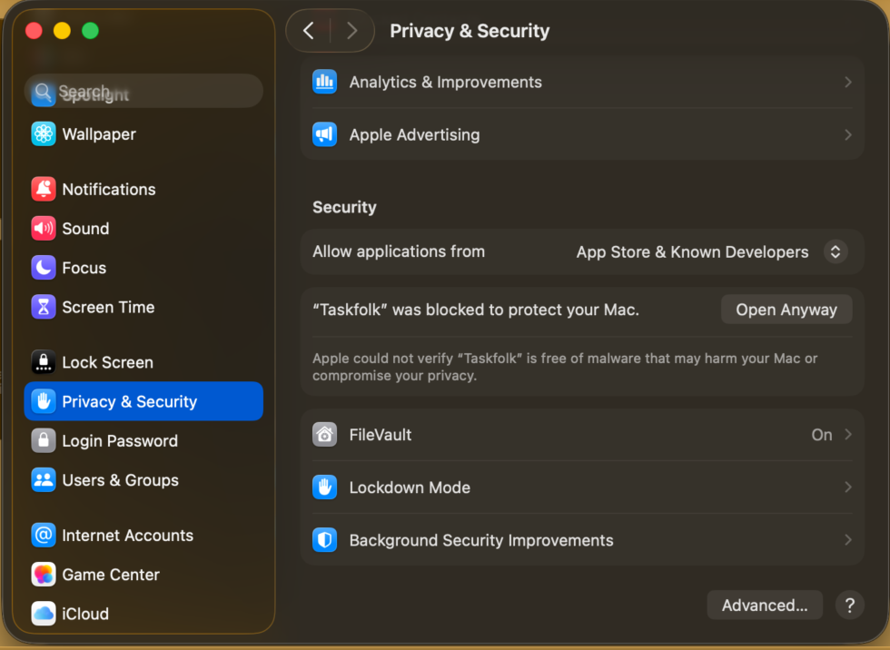
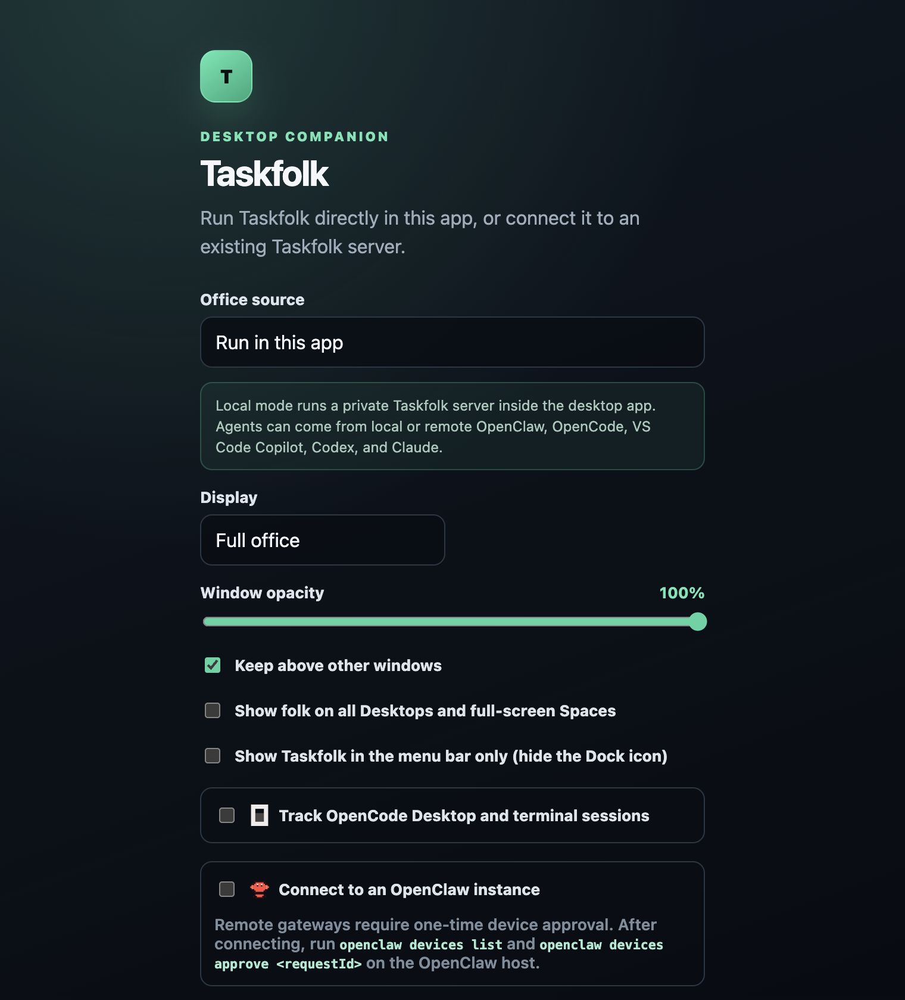
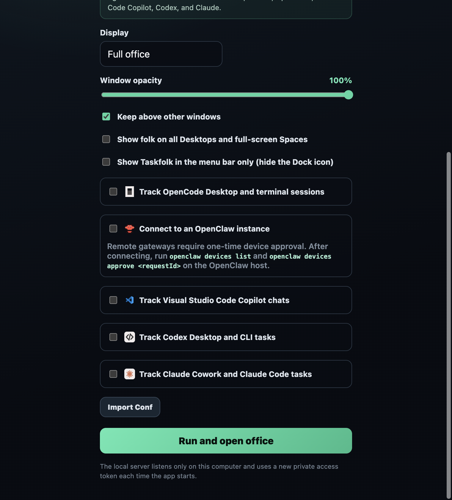
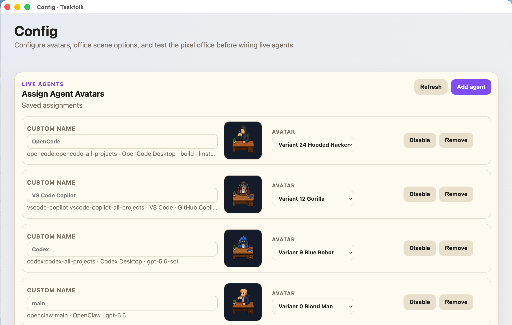
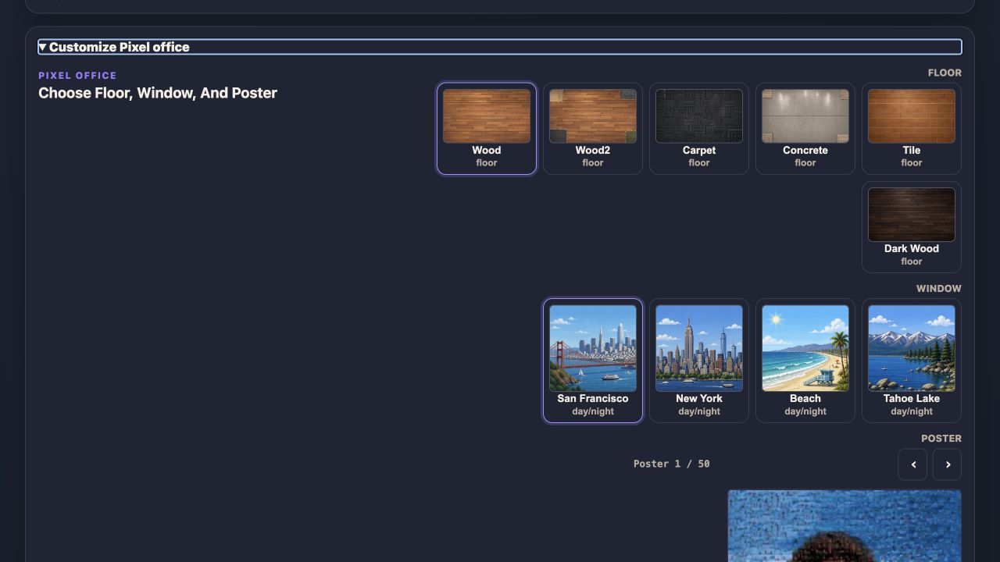
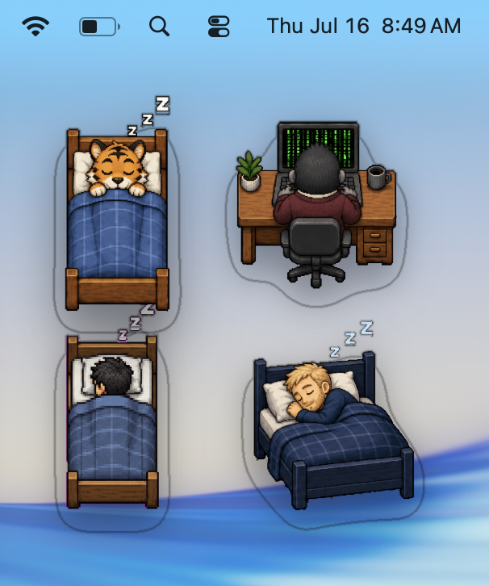

# Taskfolk User Guide for macOS

Taskfolk is a desktop companion that turns activity from AI coding tools into a live pixel office. It can show the full office or a single animated avatar that changes as an agent works, succeeds, becomes blocked, or goes idle.



## 1. Install Taskfolk from the DMG



1. Download the Taskfolk `.dmg` file.
2. Open **Finder**, go to **Downloads**, and double-click the DMG. For example, the file may be named `Taskfolk-1.0.1-arm64.dmg`.
3. When the installer window opens, drag the **Taskfolk** app onto the **Applications** folder icon.
4. Wait for macOS to finish copying the app.
5. Eject the Taskfolk installer by clicking the eject icon beside it in the Finder sidebar.
6. Open **Applications** and double-click **Taskfolk**.

> Run Taskfolk from **Applications**, not from inside the mounted DMG.

## 2. Allow Taskfolk in Privacy & Security

Beta build may be blocked because macOS does not recognize its developer.

If macOS says that Taskfolk cannot be opened because the developer cannot be verified:




1. Try to open Taskfolk once, then dismiss the warning.
2. Open the **Apple menu → System Settings**.
3. Select **Privacy & Security** in the sidebar.
4. Scroll down to the **Security** section.
5. Find the message that Taskfolk was blocked and click **Open Anyway**.
6. Authenticate with Touch ID or your Mac password if requested.
7. In the final confirmation dialog, click **Open**.

This approval is normally required only once for that installed build.




## 3. Complete the first-run Setup

Taskfolk opens the **Setup** window on first launch. The simplest configuration is to run the office locally inside the app.



### Recommended local setup

1. Set **Office source** to **Run in this app**.
2. Set **Display** to one of the following:
   - **Full office** shows every connected agent in the pixel office.
   - **Single avatar** shows one transparent desktop companion.
3. If using **Single avatar**, choose an agent or select **Most recently updated (automatic)**. You can also set a custom width and height.
4. Set **Window opacity**.
5. Choose whether to enable:
   - **Keep above other windows**
   - **Show folk on all Desktops and full-screen Spaces**
   - **Show Taskfolk in the menu bar only (hide the Dock icon)**
6. Enable the integrations you want to track. See [Configure integrations](#4-configure-integrations).
7. Click **Run and open office**.

Local mode starts a private Taskfolk server that listens only on your Mac. It creates a new private access token each time the app starts, and no separate server is required.

After Taskfolk starts, the full-office view shows the agents and their current activity in the pixel office:


## 4. Configure integrations

You can enable one or several integrations in Setup. For project-based tools, **One agent per project** gives each project its own stable avatar; **One agent for all projects** combines activity into one avatar.



### OpenCode Desktop and terminal

1. Enable **Track OpenCode Desktop and terminal sessions**.
2. Choose the grouping mode.
3. Leave **Terminal server URL** set to `http://127.0.0.1:4096` unless your OpenCode server uses another address.
4. OpenCode Desktop is detected automatically. To track a terminal session, start it with:

   ```bash
   opencode --port 4096
   ```

5. Leave the username as `opencode` unless you changed it. Enter a password only when server authentication is enabled.

### OpenClaw

1. Enable **Connect to an OpenClaw instance**.
2. For a local gateway, use the default URL `ws://127.0.0.1:18789`.
3. For a remote gateway, use `wss://` or `https://` and enter its token or password if required.
4. Click **Test connection / request approval**.
5. If Setup displays a pairing request, run the command it provides on the OpenClaw host. The command has this form:

   ```bash
   openclaw devices approve <requestId>
   ```

6. After approval, click **Test connection / request approval** again and confirm that the connection succeeds.

### Visual Studio Code Copilot

1. Enable **Track Visual Studio Code Copilot chats**.
2. Choose **One agent per project** or **One agent for all projects**.

No extra VS Code extension or Copilot token is required. Taskfolk detects non-empty chats while VS Code or VS Code Insiders is running.

### Codex Desktop and CLI

1. Enable **Track Codex Desktop and CLI tasks**.
2. Choose **One agent per project** or **One agent for all projects**.

No OpenAI API key or extra extension is required. Codex Desktop or the Codex CLI must be running for its tasks to appear.

### Claude Cowork and Claude Code

1. Enable **Track Claude Cowork and Claude Code tasks**.
2. Choose **One agent per project** or **One agent for all projects**.

No Anthropic API key or extra extension is required. Taskfolk can track local Claude Code sessions, including Code launched from Claude Desktop. Remote-only Cowork activity is not available through Claude's local data and will not appear.

### Gemini CLI and Gemini Code Assist

1. Enable **Track Gemini CLI and Gemini Code Assist Agent mode**.
2. Choose **One agent per project** or **One agent for all projects**.

Gemini CLI projects appear while the CLI is running. The Gemini Code Assist VS Code extension appears when its local Agent mode is available. The consumer Gemini app, ordinary Code Assist chat, inline completions, and JetBrains activity do not expose live local task status and will not appear.

### Google Antigravity

1. Enable **Track Google Antigravity agents**.
2. Choose **One agent per project, plus conversations** or **One agent for all Antigravity activity**.

Antigravity activity appears while the app or its local language server is running. Conversations in the same project share one agent named for the project, while all chats outside projects share one **Antigravity · Conversations** agent. Taskfolk reads Antigravity's separate title and project metadata plus local lifecycle fields; it does not publish prompts, responses, tool output, artifacts, or Google credentials.

## 5. Open Setup again

To change connections, integrations, display mode, opacity, or window behavior later, use any of these methods:

- Choose **Office → Setup…** from the macOS menu bar.
- Press **Command–Comma** (`⌘,`).
- Right-click the office or avatar and choose **Open Setup…**.
- Click the Taskfolk menu-bar icon and choose **Setup…**.

After making changes, click **Run and open office** or **Connect and open office** to save and apply them.

## 6. Use the Config page

**Setup** controls how Taskfolk connects and behaves as a macOS app. **Config** controls the agents, avatars, and appearance of the pixel office.

Open Config by right-clicking the office or avatar and choosing **Open Config…**, or choose **Office → Config…** from the macOS menu bar. An office must be running before Config can open.



### Assign and manage avatars

In **Live agents → Assign Agent Avatars**:

1. Find the agent you want to customize.
2. Enter an optional **Custom name**, or leave it blank to use the automatically generated name.
3. Select an option from its **Avatar** menu. Changes save automatically.
4. Use **Disable** to hide an agent without deleting its settings.
5. Use **Restore** to show it again.
6. Use **Remove** on a discovered runtime agent to forget its saved avatar and current discovery entry. If the project is detected again, it can return with a default assignment.

Click **Refresh** if a newly started agent does not appear immediately.

### Add a manual agent

1. Click **Add agent**.
2. Enter a name and choose an avatar.
3. Copy the generated agent token and keep it private.
4. Expand **Agent status API** for the exact endpoint and an example command that publishes the agent's state.

Manual agents can be enabled, disabled, renamed, or deleted from the same page.

### Customize the pixel office

Expand **Customize Pixel office**, then select:



- **Floor** — Wood, Wood2, Carpet, Concrete, Tile, or Dark Wood.
- **Window** — San Francisco, New York, Beach, or Tahoe Lake.
- **Poster** — browse through the available poster artwork.
- **Empty desks** — reserve from 0 to 24 unoccupied desks in the scene.

Changes save automatically and are applied to the office.

## 7. Import or export Setup configuration

Use these buttons at the bottom of Setup:

- **Export Conf** saves the current Setup configuration as `taskfolk-config.json`.
- **Import Conf** loads a previously exported JSON configuration. Review the imported settings, then open the office to apply them.

Saved credentials remain encrypted. They may need to be entered again after moving an exported configuration to another Mac. Treat exported configuration files as private because they can contain encrypted credentials, device identity data, server addresses, and window preferences.

### Install custom avatar variants

When the desktop app runs its local server, it discovers custom avatar folders at startup from:

```text
~/Library/Application Support/Taskfolk/custom-variants/
```

Put each avatar in its own folder. Numeric names such as `v28/` remain the convention, but names such as `robot-blue/` or `Robot Blue/` also work. The folder name becomes the avatar's saved identifier. A variant must contain an `avatar.json` file with a non-empty `name` and a `working.gif` file to appear in the Config avatar list. Add an optional `workingScreen` object with `left`, `top`, `width`, and `height` when the variant includes `working_alpha.png` and should use shared working-screen animations. Other pose files use the same names and format as bundled variants. Restart Taskfolk after adding or changing a custom variant. A folder with the same name as a bundled variant intentionally overrides that bundled variant.

Avatar assignments and pixel-office appearance are managed separately on the **Config** page.

## 8. Everyday controls

- Drag inside the Taskfolk window to move it.
- Drag a window edge to resize it.
- Right-click the office or avatar to change view, select another agent, add another folk, adjust opacity, toggle **Always on Top**, reload, hide, or quit.
- In single-avatar mode, transparent areas let clicks pass through to the app underneath.
- Use **Add Another Folk** to create independent avatar windows for different agents.



## Troubleshooting

### The Open Anyway button is missing

Try to open Taskfolk from **Applications** once, dismiss the warning, and immediately return to **System Settings → Privacy & Security**. The approval option appears only after macOS has blocked a launch.

### No agents appear

- Confirm that the relevant integration is enabled in Setup.
- Confirm that the coding app or terminal process is currently running.
- For OpenCode terminal sessions, use `opencode --port 4096`.
- Open Config and click **Refresh**.
- Make sure the agent was not disabled on the Config page.

### Config will not open

Open Setup and click **Run and open office** or **Connect and open office** first. Config is available only after Taskfolk has an active office source.

### A remote connection fails

Check the Taskfolk URL, gateway token, and optional password. For OpenClaw, use **Test connection / request approval** and complete device pairing when requested.

### Connect to an existing Taskfolk server

Use this option only when another Taskfolk server is already running.

1. Set **Office source** to **Connect to a remote server**.
2. Enter the **Taskfolk URL**, such as `http://127.0.0.1:3000`.
3. Enter the server's **Gateway token**.
4. Enter the **Gateway password** if the server requires one.
5. Choose the display and integration settings.
6. Click **Connect and open office**.

Taskfolk does not add these credentials to the URL. When macOS secure storage is available, saved credentials are encrypted by the operating system.


## Privacy summary

The local integrations read only the metadata needed to show activity, such as project or workspace identity, session title, model, timestamps, and lifecycle state. Taskfolk does not publish prompt bodies, responses, reasoning, tool input or output, attachments, or coding-service credentials.
